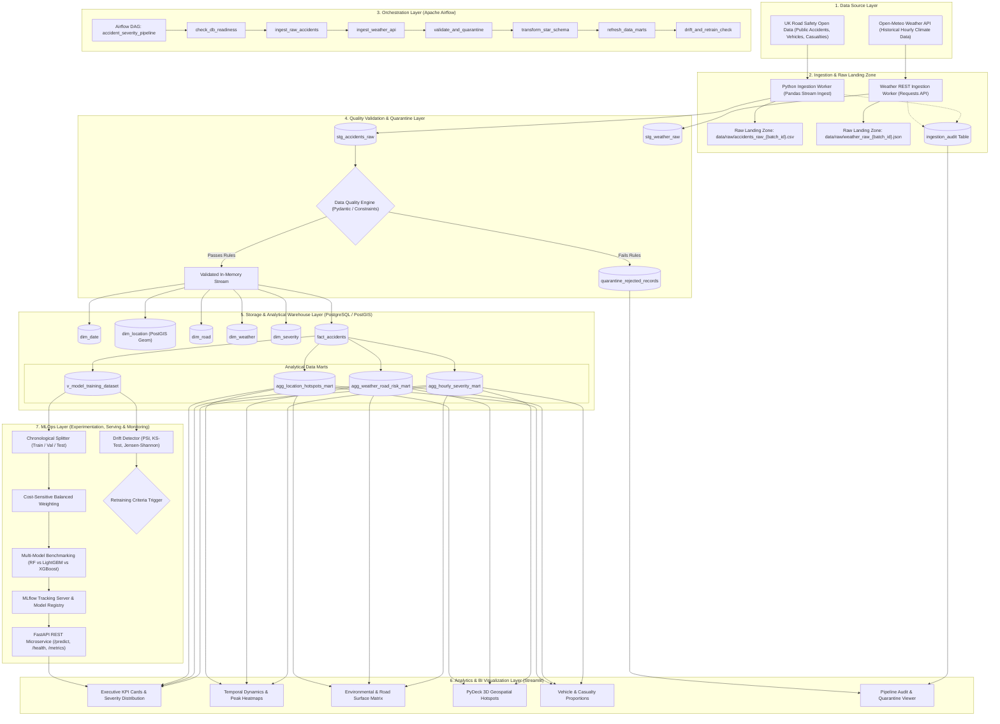
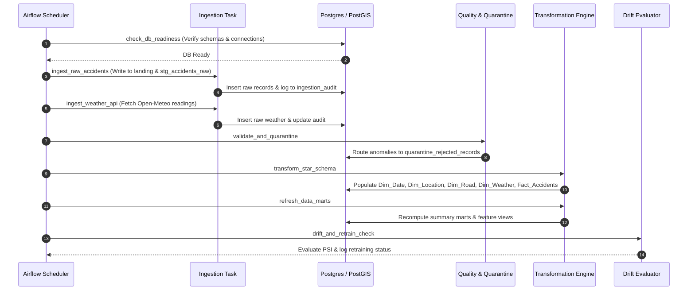
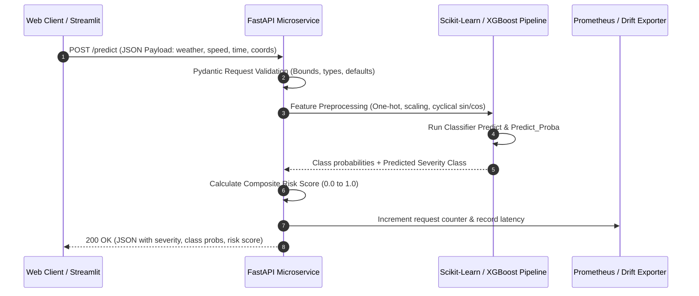

# Architecture Diagram & Pipeline Flow Specification

## 1. System Architecture Diagram

```mermaid
flowchart TD
    %% Source Layer
    subgraph Layer1 ["1. Data Source Layer"]
        DS1["UK Road Safety Open Data (Public Accidents, Vehicles, Casualties)"]
        DS2["Open-Meteo Weather API (Historical Hourly Climate Data)"]
    end

    %% Ingestion Layer
    subgraph Layer2 ["2. Ingestion & Raw Landing Zone"]
        IngestScript1["Python Ingestion Worker (Pandas Stream Ingest)"]
        IngestScript2["Weather REST Ingestion Worker (Requests API)"]
        RawCSV["Raw Landing Zone: data/raw/accidents_raw_{batch_id}.csv"]
        RawJSON["Raw Landing Zone: data/raw/weather_raw_{batch_id}.json"]
        AuditTable[("ingestion_audit Table")]
    end

    %% Orchestration Layer
    subgraph Layer3 ["3. Orchestration Layer (Apache Airflow)"]
        DAG["Airflow DAG: accident_severity_pipeline"]
        T1["check_db_readiness"]
        T2["ingest_raw_accidents"]
        T3["ingest_weather_api"]
        T4["validate_and_quarantine"]
        T5["transform_star_schema"]
        T6["refresh_data_marts"]
        T7["drift_and_retrain_check"]
    end

    %% Quality & Staging Layer
    subgraph Layer4 ["4. Quality Validation & Quarantine Layer"]
        StgAcc[("stg_accidents_raw")]
        StgWea[("stg_weather_raw")]
        DQEngine{"Data Quality Engine (Pydantic / Constraints)"}
        QuarantineTable[("quarantine_rejected_records")]
        CleanStg["Validated In-Memory Stream"]
    end

    %% Storage & Warehouse Layer
    subgraph Layer5 ["5. Storage & Analytical Warehouse Layer (PostgreSQL / PostGIS)"]
        DimDate[("dim_date")]
        DimLocation[("dim_location (PostGIS Geom)")]
        DimRoad[("dim_road")]
        DimWeather[("dim_weather")]
        DimSeverity[("dim_severity")]
        FactAcc[("fact_accidents")]
        
        subgraph Marts ["Analytical Data Marts"]
            Mart1[("agg_hourly_severity_mart")]
            Mart2[("agg_weather_road_risk_mart")]
            Mart3[("agg_location_hotspots_mart")]
            ViewFeatures[("v_model_training_dataset")]
        end
    end

    %% Analytics & BI Layer
    subgraph Layer6 ["6. Analytics & BI Visualization Layer (Streamlit)"]
        KPIs["Executive KPI Cards & Severity Distribution"]
        TemporalView["Temporal Dynamics & Peak Heatmaps"]
        WeatherView["Environmental & Road Surface Matrix"]
        SpatialView["PyDeck 3D Geospatial Hotspots"]
        CasualtyView["Vehicle & Casualty Proportions"]
        AuditView["Pipeline Audit & Quarantine Viewer"]
    end

    %% MLOps Layer
    subgraph Layer7 ["7. MLOps Layer (Experimentation, Serving & Monitoring)"]
        Splitter["Chronological Splitter (Train / Val / Test)"]
        Imbalance["Cost-Sensitive Balanced Weighting"]
        Trainer["Multi-Model Benchmarking (RF vs LightGBM vs XGBoost)"]
        MLflow["MLflow Tracking Server & Model Registry"]
        FastAPI["FastAPI REST Microservice (/predict, /health, /metrics)"]
        EvidentlyDrift["Drift Detector (PSI, KS-Test, Jensen-Shannon)"]
        RetrainAlert{"Retraining Criteria Trigger"}
    end

    %% Relationships
    DS1 --> IngestScript1
    DS2 --> IngestScript2
    IngestScript1 --> RawCSV
    IngestScript2 --> RawJSON
    IngestScript1 --> StgAcc
    IngestScript2 --> StgWea
    IngestScript1 -.-> AuditTable
    IngestScript2 -.-> AuditTable

    DAG --> T1 --> T2 --> T3 --> T4 --> T5 --> T6 --> T7

    StgAcc --> DQEngine
    DQEngine -- "Fails Rules" --> QuarantineTable
    DQEngine -- "Passes Rules" --> CleanStg
    CleanStg --> DimDate & DimLocation & DimRoad & DimWeather & DimSeverity & FactAcc

    FactAcc --> Mart1 & Mart2 & Mart3 & ViewFeatures

    Mart1 & Mart2 & Mart3 --> KPIs & TemporalView & WeatherView & SpatialView & CasualtyView
    AuditTable & QuarantineTable --> AuditView

    ViewFeatures --> Splitter --> Imbalance --> Trainer
    Trainer --> MLflow --> FastAPI
    FastAPI --> KPIs
    ViewFeatures --> EvidentlyDrift --> RetrainAlert
```

---

## 2. Airflow Pipeline DAG Workflow

```mermaid
sequenceDiagram
    autonumber
    participant Scheduler as Airflow Scheduler
    participant IngestWorker as Ingestion Task
    participant DB as Postgres / PostGIS
    participant DQ as Quality & Quarantine
    participant ETL as Transformation Engine
    participant Monitor as Drift Evaluator

    Scheduler->>DB: check_db_readiness (Verify schemas & connections)
    DB-->>Scheduler: DB Ready
    Scheduler->>IngestWorker: ingest_raw_accidents (Write to landing & stg_accidents_raw)
    IngestWorker->>DB: Insert raw records & log to ingestion_audit
    Scheduler->>IngestWorker: ingest_weather_api (Fetch Open-Meteo readings)
    IngestWorker->>DB: Insert raw weather & update audit
    Scheduler->>DQ: validate_and_quarantine
    DQ->>DB: Route anomalies to quarantine_rejected_records
    Scheduler->>ETL: transform_star_schema
    ETL->>DB: Populate Dim_Date, Dim_Location, Dim_Road, Dim_Weather, Fact_Accidents
    Scheduler->>ETL: refresh_data_marts
    ETL->>DB: Recompute summary marts & feature views
    Scheduler->>Monitor: drift_and_retrain_check
    Monitor-->>Scheduler: Evaluate PSI & log retraining status
```

---

## 3. Real-Time Model Inference Flow

```mermaid
sequenceDiagram
    autonumber
    participant Client as Web Client / Streamlit
    participant API as FastAPI Microservice
    participant Pipe as Scikit-Learn / XGBoost Pipeline
    participant Mon as Prometheus / Drift Exporter

    Client->>API: POST /predict (JSON Payload: weather, speed, time, coords)
    API->>API: Pydantic Request Validation (Bounds, types, defaults)
    API->>Pipe: Feature Preprocessing (One-hot, scaling, cyclical sin/cos)
    Pipe->>Pipe: Run Classifier Predict & Predict_Proba
    Pipe-->>API: Class probabilities + Predicted Severity Class
    API->>API: Calculate Composite Risk Score (0.0 to 1.0)
    API->>Mon: Increment request counter & record latency
    API-->>Client: 200 OK (JSON with severity, class probs, risk score)
```
